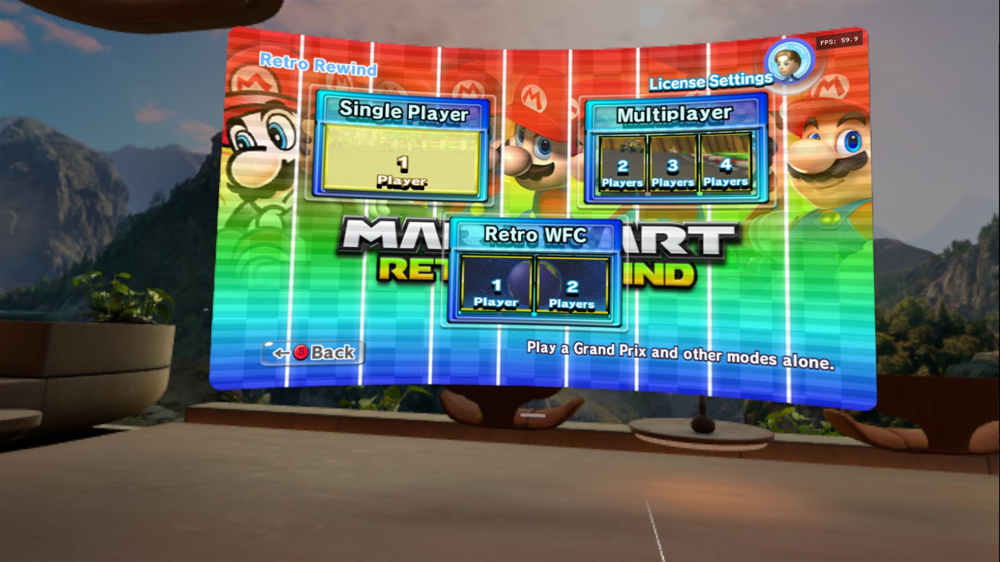
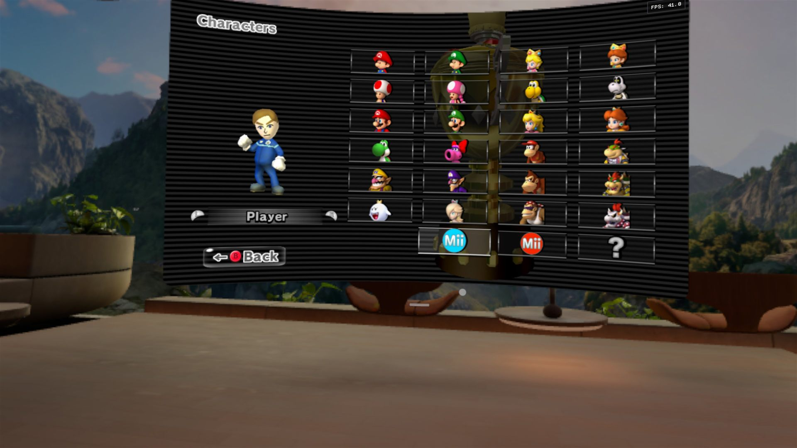
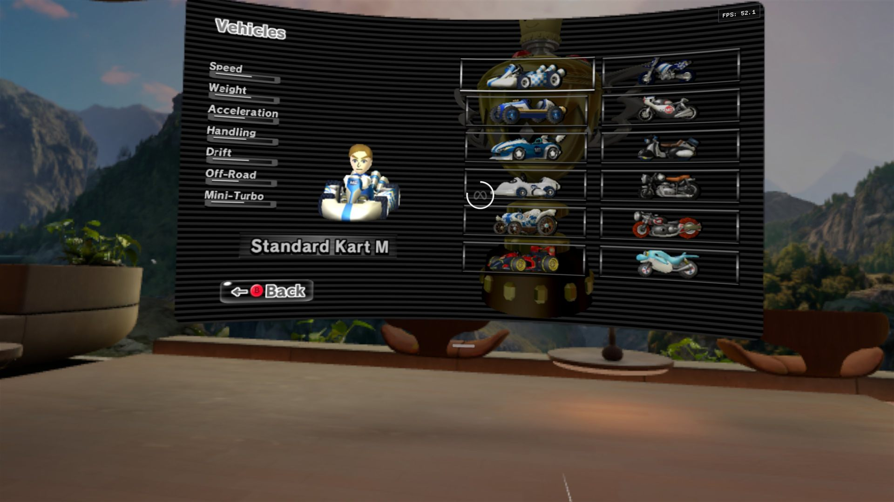
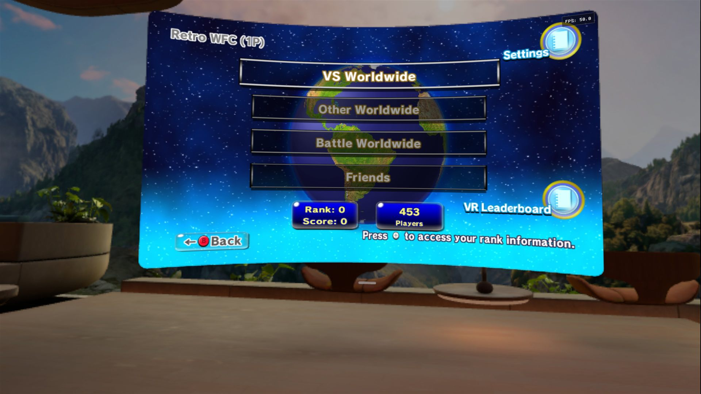

<pre align="center">
 __  __  _  ____      __   ___   _   _  _____  ____  _____
|  \/  || |/ /\ \    / /  / _ \ | | | || ____|/ ___||_   _|
| |\/| || ' /  \ \/\/ /  | | | || | | ||  _|  \___ \  | |
| |  | || . \   \    /   | |_| || |_| || |___  ___) | | |
|_|  |_||_|\_\   \/\/     \__\_\ \___/ |_____||____/  |_|

   ______________________________________________________________
  |  ##  ##  ##  ##  ##  ##  ##  ##  ##  ##  ##  ##  ##  ##  ##  |
  |    ##  ##  ##  ##  ##  ##  ##  ##  ##  ##  ##  ##  ##  ##    |
  |  ##  ##  ##  ##  ##  ##  ##  ##  ##  ##  ##  ##  ##  ##  ##  |
  |______________________________________________________________|
</pre>

<p align="center"><b>Mario Kart Wii on the Meta Quest 3, built from your own disc.</b></p>
<p align="center">
  Native arm64 build through WiiCompiled's static recompilation, rendered by aurora on Vulkan.<br>
  A real VR app: menus hang in your room as a flat screen, races are rendered per eye from the driver's seat.<br>
  Retro Rewind supported. No game data in this repository, ever.
</p>

<h1 align="center">FULL VR MODE &mdash; out now in v0.3.0-beta</h1>

<p align="center">
  
  
  
  
</p>

<pre align="center">
                    3  .  .  2  .  .  1  .  .  GO
</pre>

<table align="center">
  <tr>
    <td align="center"><br><sub>Main menu, 60 fps</sub></td>
    <td align="center"><br><sub>Character select</sub></td>
  </tr>
  <tr>
    <td align="center"><br><sub>Vehicle select</sub></td>
    <td align="center"><br><sub>Retro WFC, online</sub></td>
  </tr>
</table>
<p align="center"><sub>Screenshots from the headset; the fps counter top right is the game's own.</sub></p>

---

## Select Your Course

| Course | What is there |
|---|---|
| [Trophy Room](#trophy-room) | who made this possible |
| [Race Results](#race-results) | what runs on the headset today |
| [Rules of the Track](#rules-of-the-track) | what you bring, what this repository never contains |
| [Starting Grid](#starting-grid-what-your-pc-needs) | what your PC needs |
| [Grand Prix](#grand-prix-building-the-apk) | building the APK, lap by lap |
| [Cockpit](#cockpit-controls-and-the-vr-menu) | controls, and every dial in the in-headset menu |
| [Pit Lane](#pit-lane-what-happens-under-the-hood) | what the scripts do |
| [Pit Stop](#pit-stop-updating-retro-rewind) | updating Retro Rewind |
| [Tuning](#tuning-switches-without-rebuilding) | switches without rebuilding |
| [Garage](#garage-repository-layout) | repository layout |
| [Final Standings](#final-standings-license) | license and trademarks |

---

## Trophy Room

**1st place, always: the WiiCompiled team.**
This project exists only because of the people behind
[WiiCompiled](https://github.com/patchzyy/Wiicompiled), the static
recompilation of Mario Kart Wii for PC: the translator, the runtime, the
embedded [aurora](https://github.com/encounter/aurora) GX layer, the Retro
Rewind integration and the installer that turns a player's own disc into a
native build. Everything here is a thin Android and Quest layer on top of
their work.

**2nd place: [encounter](https://github.com/encounter)** for aurora, nod and
the prebuilt Dawn that the Quest build links against.

**3rd place: the Retro Rewind team** for the pack and the Retro WFC servers
that keep online play alive.

**Pit crew:** this port was vibe-coded with Claude Fable 5.1. The renderer
investigation, the patches, the build scripts and this README were written
in that collaboration; every result was verified on the headset.

---

## Race Results

| Position | Lap | Result |
|---|---|---|
| 1st | Boot, menus, sound, Xbox controller | Finished. Menus at 60 fps |
| 1st | 3D models (characters, karts, wheels, trophies, Miis) | Finished since 2026-09-07 |
| 1st | Video panels in the main-menu buttons | Finished since 2026-09-08 (same driver fault, direct vertex formats with an odd stride) |
| 1st | Online play (Retro WFC) | Finished since 2026-09-08, see [Pit Stop](#pit-stop-updating-retro-rewind) |
| 2nd | Races on the track | Running, 36 fps on the starting grid with all 12 karts in view, 40 to 60 fps once the field spreads out (was 18 to 25 until 2026-09-09). Below 60 fps the game itself runs slower than real time; the remaining cost is measured, see the Tuning bits |
| 1st | Immersive app, flat screen in the room | Finished. The app takes the whole display; menus are a screen standing in your room, size, distance and height adjustable |
| 1st | Per-eye rendering in local races | Finished. Own projection per eye from the headset's own field of view, head rotation and head movement both applied. The switch between screen and per-eye is automatic and comes from the game's own section id, not from a guess |
| 2nd | Per-eye rendering online | Not yet. Online races stay the flat screen in your room; see the note below |
| 1st | First-person seat | Finished since 2026-09-11. The eye sits where the game puts the driver's head: the head bone was read out of the driver's skeleton and measured at 54 game units above the kart's origin. No invented metre, no world scale. The driver can be taken out of the picture while the kart stays |
| 1st | Touch controllers | Finished. A full GameCube pad, mapped from what the buttons actually do in game rather than from a layout diagram, see [Cockpit](#cockpit-controls-and-the-vr-menu) |
| 2nd | Motion controls (shake to trick, tilt to steer) | Not started. The game is either a GameCube pad or a Wii Remote, so this is a mode switch rather than an addition |

> **Yellow flag: full VR is local play only, for now.** Online races stay the
> flat screen standing in your room -- still immersive, still head-tracked, but
> not per eye. The reason is deliberate rather than broken. The app does not
> guess when you are racing; it reads the game's own section id, and exactly one
> section has been measured on the headset from start to finish: the local race,
> id 30. Time trials, battle and online almost certainly carry ids of their own,
> and an id nobody has watched is treated as *not racing* and logged once. The
> flat screen is the safe answer, because a camera placed inside a menu -- or
> inside a mode that turns out to draw differently -- is somewhere nobody wants
> to be, especially with a headset on. The list grows from measurements, not
> from guesses; each new id costs one race and one log line.

> **Lakitu's note on the Adreno 740.** The Quest 3's shader compiler
> miscomputes the storage-buffer word address
> `(base + index * stride + offset) >> 2` when the terms are not multiples of
> 4 (it distributes the shift over the sum), so every indexed vertex fetch and
> every direct format with an odd stride read one word too early. The build
> works around it by expanding such draws on the CPU into a 4-byte-aligned
> direct vertex layout, where every address term is a multiple of 4. The
> workaround is on by default for Android and can be switched off in
> `Config.toml` for comparison (`[debug] aurora_deindex = false`). Measured
> on the headset, the expansion itself costs about 3.6 ms per frame with all
> 12 karts in view (14 000 draws); a per-draw diagnostic string that used to
> sit next to it cost 10 ms and is gone. The compute-shader reproduction that
> pins the fault ships with the build (`[debug] aurora_gx_debug = 2048`).

---

## Rules of the Track

This repository contains **no game data and never will**: no disc image, no
`main.dol`, no `StaticR.rel`, no asset, no ghost, no translated game code.
Nothing here helps you obtain any of that.

**You bring:**

- **Your own Mario Kart Wii PAL disc (`RMCP01`)**, dumped from your own copy,
  as ISO, WBFS, RVZ, WIA, GCZ, CISO or NKit. The dump is checked against the
  game ID and the hashes of `main.dol` and `StaticR.rel` that WiiCompiled pins;
  a different game, region or disc revision is refused.
- Optional: a **Retro Rewind 6** folder containing `Binaries\Code.pul`. The
  builder's **Get / update Retro Rewind** button (`tools\Get-RetroRewind.ps1`)
  downloads it from the Retro Rewind update server and keeps it current; a
  folder that WheelWizard manages works just as well.

> **Blue shell warning.** Every build carries your translated game code and
> is for your headset only. Do not share APKs. Share this repository instead;
> everyone races on their own disc.

---

## Starting Grid: what your PC needs

| Part | Requirement |
|---|---|
| Windows | Windows 10/11 x64 |
| Memory | **8 GB RAM**. Measured on a full build: one compile peaks at about 0.5 GB, four running in parallel at 1.5 GB, the final link at under 1 GB. The scripts pick the number of parallel compiles from the free memory (one per GB, at most one per core) |
| Disk | about 10 GB free: the work directory (WiiCompiled clone, extracted disc, translated code, native build) measured 4.4 GB, Retro Rewind 2 GB plus its 1.8 GB download |
| CPU | any 64-bit x86. Measured on a Ryzen 7 5700U (8 cores, laptop): the whole first build from clone to APK took 19 minutes, the native build inside it 14 to 15 minutes; a rebuild after a code change about 30 seconds. Fewer cores or a slower disk stretch the native build accordingly |
| Android SDK | **NDK 28.x**, **build-tools 35.0.0**, **platform android-34**, the **CMake** package (brings CMake and Ninja) and `platform-tools` (adb). Android Studio's SDK Manager installs all of them |
| Tools | a JDK 17 or newer (`javac`), Git for Windows, .NET SDK 8 or newer |
| Headset | a Quest 3 in developer mode, connected over USB with USB debugging allowed |

---

## Grand Prix: building the APK

### Lap 1: line up

1. **Get the tools.** Download `MKW-Quest3-Port-<version>.zip` from the
   **Releases** page (builder, scripts, patches and Android packaging files,
   nothing else), or clone this repository. Both work the same way.
2. **Make a folder for the port** and unpack the zip into it, for example
   `C:\MKW-Quest`. Rules for the path: no spaces, not inside the Android SDK,
   not inside a cloud-synced folder (OneDrive, Dropbox). After unpacking you
   should see `Quest-Builder.cmd`, `tools\`, `patches\` and `android\` in it.
3. **Have your disc dump ready** somewhere on the PC, for example
   `C:\MKW-Quest\disc\mkw.wbfs`. It is only read, never copied into the port
   folder.

### Lap 2: build

4. **Double-click `Quest-Builder.cmd`.** The window has five fields:
   - *Your Mario Kart Wii disc image (PAL)*: the dump from step 3.
   - *Retro Rewind 6 directory (optional)*: leave it **empty** the first time;
     the button in step 6 fills it in.
   - *Android SDK*: found automatically when Android Studio installed it;
     otherwise the folder that contains `ndk\`, `build-tools\` and
     `platforms\`.
   - *Work directory (created here)*: a **new, empty** folder with about 40 GB
     free, for example `C:\MKW-Quest\workspace`. Everything the build creates
     (the WiiCompiled clone, your extracted disc, the translated code, the APK)
     lands there.
   - *BuildWorkspace (legacy)*: leave it empty.
5. **Check the list.** Every required line must say OK; fix what is missing
   (the *Where* column says what was looked for). The optional lines may stay
   red for now.
6. **Click "Get / update Retro Rewind"** (optional, needed for online play).
   It downloads Retro Rewind (about 1.8 GB) into `RetroRewind6` next to the
   work directory, fills in the field, and the line *Retro Rewind up to date*
   turns green.
7. **Click "Build APK".** First time: about 20 minutes (clone and patch
   WiiCompiled, build the translator, validate and extract your disc,
   translate the game, native build of about 15 minutes, package). The log ends with
   `APK: <work directory>\android\out\mkw-quest.apk`. Every step is skipped
   when its result already exists, so a failed run continues where it
   stopped: fix the cause and click again.

### Lap 3: race

8. **Connect the Quest** (developer mode, USB debugging allowed on the
   headset), tick *Push game data to the headset* and click
   **"Install on Quest"**. The first push copies several GB of game data to
   `/sdcard/MKW`; later installs without the tick only replace the app.
9. **Start the app** from the headset's app library under *Unknown sources*.
   It opens straight into VR: the menus as a screen standing in your room, the
   race per eye from the driver's seat. Nothing has to be switched on first.

> **The first minutes stutter, and that is on purpose.** Shaders are compiled
> as the game asks for them, and this build waits for them instead of skipping
> the draw. Skipping keeps the frame rate up but loses anything the game bakes
> once into a texture -- several vehicle preview pictures came out black and
> stayed black until the app was restarted. A stutter heals itself; a black
> bake does not. Once the cache is warm it is gone, and the trade is a tick in
> the in-headset menu (*Skip draws while shaders compile*).

> **Item box.** Updates later are short: **Get / update Retro Rewind**, then
> **Build APK** (minutes), then **Install on Quest** without the tick.

### What the buttons do

- **Build APK** clones WiiCompiled at the pinned commit into the work
  directory, applies the patches, builds the translator, validates and
  extracts your disc, translates the game (the long step, plus the native
  build), and writes `android\out\mkw-quest.apk` inside the work directory
  (the APK carries the translated game code, so it never lands in the port
  folder or in this repository).
- **Install on Quest** installs the APK over adb, grants the storage
  permission and, with the checkbox ticked, pushes the game data.

The same pipeline runs from a terminal:

```powershell
.\tools\Invoke-QuestPipeline.ps1 -Workspace D:\mkw-quest-work -DiscImage D:\dumps\mkw.wbfs `
    -RetroRewindDirectory "$env:APPDATA\CT-MKWII\RetroRewind\RetroRewind6" -Install -PushAssets
```

Start the app from the headset's app library (unknown sources). Starting it
with `adb shell am start` is not useful: Horizon OS suspends an app it did not
launch itself.
Logs: `adb logcat -s mkw`.

---

## Cockpit: controls and the VR menu

### What each button does

Read out of the game and then confirmed by playing a race, which is worth saying
because the first version of this table was written from a GameCube layout
diagram and had three of its six rows wrong.

| Touch controller | In a race | In the menus |
|---|---|---|
| Left thumbstick | Steer | Move the cursor |
| **Left trigger** | Brake, reverse, and the drift hop | **Back / cancel** |
| **Right trigger** | Accelerate | **Confirm** |
| **Grip, either hand** | **Trick** | Cursor up |
| Right thumbstick | Trick, with a direction | Move the cursor |
| **Right A or B** | **Use an item** | — |
| Left X or Y | Look behind | — |
| Left menu button, short press | Pause | Pause |
| Left menu button, held 0.5 s | Open the VR menu | Open the VR menu |

**Why the grip is the trick button.** A trick is a single D-pad edge, and there
are moments where it has to land on a beat -- a POW block about to go off is the
one everybody knows. A finger already curled around the grip hits that; a thumb
that has to find a stick and flick it does not.

**Why braking and drifting share one control.** Because the game reads them as
one. `B` and `R` are a single mask to Mario Kart Wii, and what you get is decided
by the throttle, not by the button: with the accelerator held, a fresh press is a
hop; without it, the same press brakes and then reverses. No mapping can separate
them, so the left trigger carries all three and the grip is free for the trick.

Three controller profiles are bound (`oculus/touch_controller`,
`meta/touch_controller_plus`, `meta/touch_controller_quest_2`) plus the Khronos
simple fallback. Binding only one is not enough -- a runtime that picks a
different name for the same hardware then reports a controller with no bindings,
which looks exactly like a controller that was not detected.

If a real gamepad is plugged in, it keeps port 0 and the Touch controllers move
to port 1, where this game does not read them. The pad wins, silently and
completely.

### The VR menu

**Hold the left menu button for half a second.** A short press is pause; only the
long press opens this. Every dial takes effect immediately and is written back to
`Config.toml`, so nothing has to be set twice.

| Dial | What it does |
|---|---|
| **Mode** | *Cinema* is the flat screen in your room, *Stereo* renders the race per eye. Stereo is the default and switches to the flat screen for menus by itself |
| **First-person seat** | On puts the eye where the driver's head is. Off leaves it on the game's own chase camera, in stereo, with the head free to look around -- a way of playing in its own right, not a fallback |
| **Seat height** / **Seat forward** | Trim the seat, in the game's own units along the kart's axes. They start at the measured head position (54.0 and -2.0), so they trim an answer rather than search for one |
| **Hide driver** | Takes the driver out of the picture and leaves the kart in it. From the seat, his head is otherwise in front of your eye |
| **Scale** / **Vertical offset** | The HUD. A HUD drawn for a television lands at the edge of vision in a headset, so it is pulled towards the centre. Its depth is deliberately never touched |
| **World scale** | How many game units make a metre, for your head's own movement. Not derivable, so it is measured by standing in the world and looking |
| **Head movement** | How much of your head's movement (not its rotation) reaches the game camera |
| **Recentre now** | Takes your current heading as forward. Entering stereo does this by itself |
| **Distance** / **Height** / **Width** / **Height (size)** | The screen in your room, in metres |
| **Skip draws while shaders compile** | Off by default here, see the note in Lap 3 |

---

## Pit Lane: what happens under the hood

| Step | Script | What it does |
|---|---|---|
| 1 | `tools\New-StandaloneWorkspace.ps1` | `git clone` of WiiCompiled at `e6f9b21`, Fix AA, patches `0001` to `0004`, `dotnet build` of the translator |
| 2 | `tools\Import-DiscImage.ps1` | `nodtool info` (game ID), `nodtool extract` to `GameAssets\DATA`, hash check, `Assets\main.dol` + `StaticR.rel` |
| 3 | `tools\Translate-Game.ps1` | `translate-recursive`, `emit-base-manifest`, optional `translate-mod` (Retro Rewind), `generate-data-init`, `emit-build-shards`, all with `--target-os android` |
| 4 | `tools\Build-Quest.ps1` | CMake with the NDK toolchain (`arm64-v8a`, `android-34`, prebuilt Dawn for Android), Ninja, APK packaging without Gradle. The APK is always the immersive one: the choice between a flat screen in the room and per-eye rendering is made inside the app, not at build time |
| 5 | `android\deploy.ps1` | `adb install`, `appops` storage grant, push of `DATA` and Retro Rewind to `/sdcard/MKW`, `Config.toml` |

`nodtool` comes from [encounter/nod](https://github.com/encounter/nod)
(MIT/Apache-2.0) and is downloaded once if the WiiCompiled toolkit is not
installed. The Retro WFC online payload is fetched by the translator from the
Retro WFC server during the build, exactly as WiiCompiled does on PC; a build
without it (`Translate-Game.ps1 -SkipRetroWfc`) plays offline only.

A legacy mode reuses the translation of an installed WiiCompiled PC build
instead of a disc image (`tools\New-QuestWorkspace.ps1`,
`tools\Regenerate-AndroidTranslation.ps1`); the GUI falls back to it when no
disc image is given. It is part of the source tree only, not of the release
archive.

---

## Pit Stop: updating Retro Rewind

Retro Rewind updates often, and the Retro WFC server only lets the current
pack version online (error 22010 otherwise). The mod code is compiled into the
app, so every update means a rebuild:

1. Click **Get / update Retro Rewind** in the builder (or let WheelWizard
   update the folder, if that is where it came from). The updater reads
   `version.txt`, fetches only the delta packages since that version and
   applies them in order; the builder shows whether the folder is current.
2. Run **Build APK** and **Install on Quest** (with the game-data checkbox)
   again. The pipeline notices the new `Code.pul`, translates only the mod
   again, rebuilds only the mod's part of the native code (roughly 15 to 30
   minutes) and pushes only the files that changed on the headset.

Offline modes and time trials keep working with an old pack; only online play
needs the rebuild.

> **Yellow flag for installs made with earlier versions of these scripts.**
> If the app ends right at start with `Missing bundled Wii DSP coefficient
> ROM (dsp_coef.bin)` in `adb logcat -s mkw`, the headset lacks three things
> the old install step never copied: the runtime's DSP coefficient file, its
> first-run NAND bootstrap and Retro Rewind's Riivolution XML. Either click
> **Install on Quest** once more with the current scripts (the checkbox is
> not needed; the step now pushes them every time), or push them by hand
> from the work directory and the folder next to `RetroRewind6`:
>
> ```
> adb push <work directory>\build-android\dsp_coef.bin /sdcard/MKW/WiiCompiled/
> adb push <work directory>\build-android\wii_bootstrap /sdcard/MKW/WiiCompiled/
> adb push <folder above RetroRewind6>\riivolution /sdcard/MKW/
> ```
>
> Afterwards `/sdcard/MKW/WiiCompiled` holds `dsp_coef.bin` and
> `wii_bootstrap` next to `Config.toml`, and `/sdcard/MKW/riivolution`
> holds `RetroRewind6.xml`.

---

## Tuning: switches without rebuilding

Everything in the in-headset menu is written to
`/sdcard/MKW/WiiCompiled/Config.toml`, and everything in that file can also be
edited by hand. The defaults below are what a fresh install gets -- none of them
have to be typed in.

```toml
[video]
resolution_multiplier = 3.0   # the game renders at the Wii's own 640x528; stretched across a
                              # headset that is a factor of 2.6, so it is rendered larger instead.
                              # Measured: 52 to 61 fps at 3.0, for nine times the pixels
skip_unready_pipelines = false # wait for a shader rather than drop the draw. See Lap 3

[vr]
mode = "stereo"               # "stereo" races per eye and keeps menus flat; "cinema" is the flat
                              # screen everywhere; "panel" starts no VR session at all
ego_camera = true             # the eye in the driver's place; false is the game's chase camera
seat_height = 54.0            # where the driver's head sits above the kart's origin, in game
seat_forward = -2.0           # units along the kart's own axes. Measured, not chosen
hide_driver = true            # the driver leaves the picture, the kart stays
hud_scale = 0.38              # the HUD pulled towards the centre of vision
hud_offset_y = 0.0
world_scale = 100.0           # game units per metre, for your own head's movement
head_translation = 0.0        # how much of that movement reaches the game camera
screen_distance = 2.5         # the screen in your room, in metres
screen_width = 3.2
screen_height = 1.8
```

The `[debug]` section is for looking into the renderer rather than playing:

```toml
[debug]
aurora_deindex = true      # the Adreno workaround; false shows the driver fault
aurora_gx_debug = 0        # renderer diagnostics bit mask: 2048 = compute-shader reproduction of the driver fault,
                           # 8192 = one log line per second with the per-frame cost of the workaround (adb logcat -s mkw),
                           # 16384 (with 8192) = also count how many expanded draws repeat between frames
dawn_validation = false
vr_debug = 0               # bit 0 = one timing line per second from the OpenXR side,
                           # bit 2 = the driver's-head probe, for working on the seat
```

---

## Garage: repository layout

| Path | Contents |
|---|---|
| `patches/` | the four patches against WiiCompiled `e6f9b21`: Android target, translator `--target-os`, the Quest renderer work (Adreno workaround, JNI guard, debug switches), and the OpenXR side (immersive session, per-eye rendering, the seat, the controllers, the in-headset menu) |
| `android/` | manifest, Java activity, packaging and deploy scripts |
| `tools/` | pipeline scripts, the GUI, the release packer |
| `.github/workflows/` | the release workflow: a tag `v*` packs the release archive and publishes it |
| `images/` | screenshots from the headset for this README |

Real paths to your installation go into `local.paths.md`, which is
git-ignored.

---

## Final Standings: license

This project is licensed under the **GNU General Public License v3.0**, see
[`LICENSE`](LICENSE). WiiCompiled is GPL v3 and its README requires every
Mario Kart Wii distribution that uses it to be GPL v3 as well; this
repository and every build made from it follow that.

The port is written against WiiCompiled commit `e6f9b21`; the work directory
is a clone at exactly that commit, so newer upstream changes cannot break the
patches. aurora is MIT, nodtool is MIT/Apache-2.0, the remaining components
are listed in [`THIRD-PARTY-NOTICES.md`](THIRD-PARTY-NOTICES.md).

Mario Kart and Wii are trademarks of Nintendo. This project is not affiliated
with, endorsed by or connected to Nintendo. No game data of any kind is part
of this project or of any build made from it.

<pre align="center">
   ______________________________________________________________
  |  ##  ##  ##  ##  ##  ##  ##  ##  ##  ##  ##  ##  ##  ##  ##  |
  |    ##  ##  ##  ##  ##  ##  ##  ##  ##  ##  ##  ##  ##  ##    |
  |______________________________________________________________|
                         FINISH
</pre>
